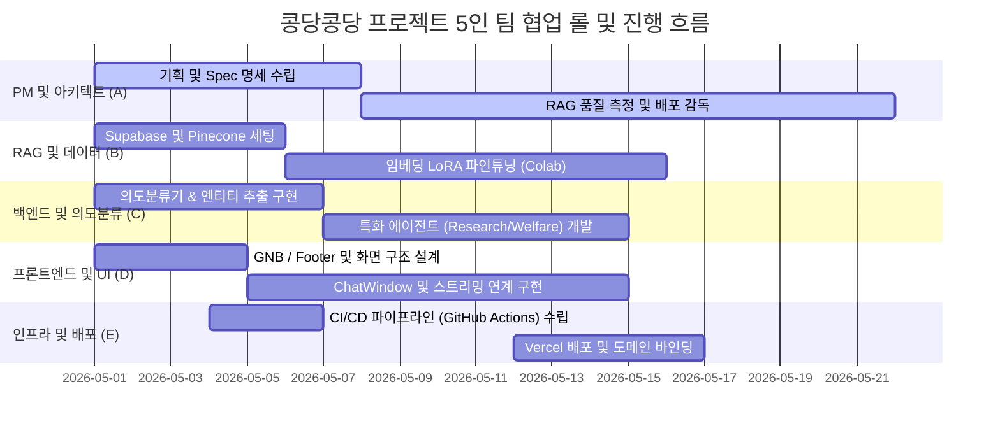

# 콩당콩당 프로젝트 개요 (PROJECT_BRIEF)

## 📌 프로젝트 기본 정보

* **프로젝트명**: 콩당콩당 (콩팥 + 당뇨 복합 에이전트 서비스)
* **서비스 비전**: 콩팥병(CKD)과 당뇨병(DM) 환자 및 보호자를 위한 통합 AI 건강 비서 및 복지 플래너
* **챗봇 지향점**: 신뢰성 높은 의학적 근거(PubMed)와 접근성 높은 국가 혜택(복지 정책)을 단일 챗봇 대화창에서 편리하게 조회할 수 있도록 설계

---

## 💾 데이터 소스 및 RAG 인프라

### 1. 글로벌 의학 연구 데이터
* **PubMed E-utilities API**: 미국 국립생물정보센터(NCBI)의 최신 5년 이내 논문 메타데이터 및 초록 실시간 수집
* **Pinecone Vector DB (`kongdang-papers`)**: 주요 콩팥·당뇨 저널 및 논문을 벡터화하여 시맨틱 유사도로 로컬 임베딩 검색 병행

### 2. 국내 의료 복지 공공 데이터
* **보건복지부 + 식약처 + 심평원**: 공공데이터포털 및 각 부처에서 배포하는 희귀질환 산정특례, 요양비 지원, 의료급여 조건 가이드 문서
* **Supabase PostgreSQL (`welfare_documents`)**: FTS(Full-Text Search) 인덱스를 이용한 한국어 형태소 적합도 기반 고속 BM25 검색

---

## ⚙️ 핵심 설계 아키텍처

### 1. 조건부 에이전트 할당을 통한 비용 극소화 (Zero-Cost Intent Routing)
* 사용자의 일상적인 건강 관리 및 대화(예: 식단 정보, 격려성 대화)는 무거운 RAG 인프라나 특화 에이전트를 거치지 않고 **GPT-4o-mini 일반 스트리밍**으로 직결 처리.
* 키워드 매칭(비용 0%)을 우선 적용하고, 불명확할 때만 Few-shot LLM에 판단을 유임하여 비용과 지연 시간을 대폭 개선.

### 2. Hybrid RAG & RRF (Reciprocal Rank Fusion) 병합
* PubMed API의 실시간성과 Pinecone 벡터 시맨틱 데이터의 깊이를 RRF 알고리즘을 사용해 결합.
* 별도의 세밀한 가중치 조정(Weight Tuning) 없이 고성능 다중 도큐먼트 병합 가능.

### 3. LoRA 미세조정 (Colab T4 하이퍼파라미터 튜닝)
* **BGE-M3 임베딩 모델**: 콩팥병·당뇨 전용 한글 의학 용어 이해도를 대폭 증가시키기 위해 PEFT(LoRA) 기법으로 미세 조정 후 Pinecone 적재.
* **BGE-Reranker-Large 모델**: 1차 RAG로 추출된 도큐먼트들의 적합성을 가릴 수 있도록 교차 엔트로피 손실 함수로 미세조정.

---

## 🛠️ 기술 스택

* **Frontend & Server Side**: Next.js 14 App Router (Vercel 배포 단일화)
* **Vector Database**: Pinecone JS SDK
* **Relation Database**: Supabase JS SDK (PostgreSQL + TSVECTOR 형태소 분석기)
* **LLM Engine & SDK**: OpenAI GPT-4o-mini & Vercel AI SDK (StreamingTextResponse)
* **Authentication**: NextAuth.js (자체 로그인 스터브 지원)

---

## 👥 팀원 역할 구성 (5명 협업 모델)

* **A (PM / Spec 설계)**: 요구사항 관리, 기능별 스펙 문서화, 에이전트 기획 및 평가(RAGAS) 총괄
* **B (RAG & LoRA 임베딩 / DB)**: Pinecone 데이터 벌크 업로드 및 Supabase 스키마 구축, BGE-M3 임베딩 파인튜닝 파이프라인 개발
* **C (의도분류 & 에이전트 개발)**: `intentClassifier`, `entityExtractor`, `researchAgent`, `welfareAgent` 코어 라우팅 설계 및 구현
* **D (Next.js UI 개발)**: ChatWindow, InputBar, MessageBubble, GNB 반응형 디자인 구현, Vercel AI SDK 프론트 연동
* **E (DevOps & QA)**: GitHub Action CI 파이프라인, Vercel 단독 배포 환경 구축 및 RAGAS RAG 성능 지표 프로파일링
