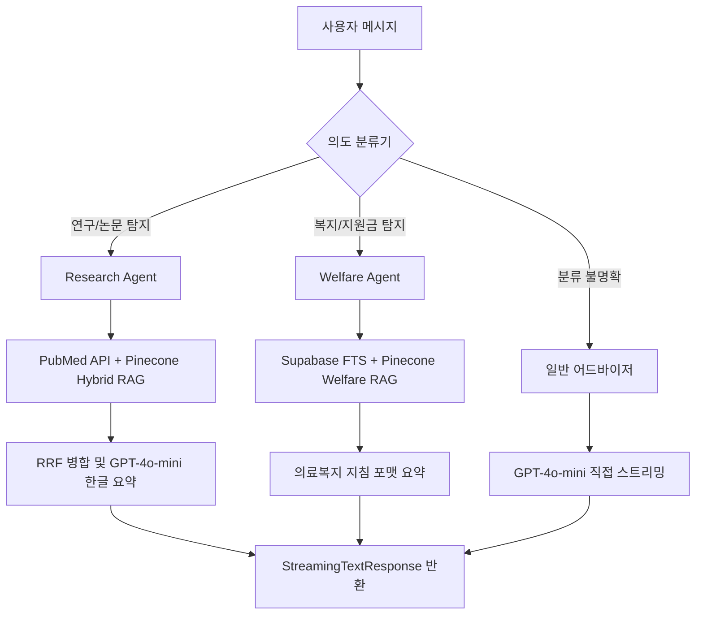

# 콩당콩당 (Kongdang-Kongdang)

> **콩팥병(CKD) + 당뇨(DM) 환자를 위한 의도 탐지 기반 조건부 멀티에이전트 AI 챗봇**

콩당콩당은 콩팥병 및 당뇨 복합 만성질환 환자들을 위한 지능형 헬스케어 동반자 서비스입니다. 최신 글로벌 학술 연구 논문(PubMed)과 국가 공공 복지 데이터(보건복지부, 식약처, 심평원)를 RAG(Retrieval-Augmented Generation) 기술로 통합 제공하여 높은 의학적 정확도와 실질적인 복지 안내를 융합 제공합니다.

---

## 🚀 빠른 시작

```bash
# 1. 환경 설정 파일 구성
cp .env.local.example .env.local

# 2. 패키지 설치
npm install

# 3. 개발 서버 기동
npm run dev
```

---

## 🏥 Supabase 세팅

1. Supabase 대시보드 로그인 > 프로젝트 생성.
2. **SQL Editor**로 이동하여 `db/schema.sql` 스크립트를 붙여넣고 **Run**을 실행합니다.
3. 생성된 `search_welfare` RPC 함수 및 `welfare_documents` 인덱스가 정상 활성화되었는지 검사합니다.

---

## 🤖 챗봇 작동 원리

사용자가 질문을 작성하면 아래의 분류 로직에 의거하여 지능적으로 라우팅됩니다.



1. **발화 → 의도 분류 (Cost 0%)**
   - 1차 키워드 매칭을 통해 발화의 의도를 분류합니다 (비용 0).
   - 키워드가 동시 포함되거나 모호한 경우에만 GPT-4o-mini few-shot Fallback을 적용하여 라우팅합니다.
2. **Research Agent (연구논문 특화)**
   - PubMed API 실시간 검색 + Pinecone 벡터 시맨틱 검색을 병행하고 **RRF(Reciprocal Rank Fusion)**를 통해 정밀 병합 후 한국어로 맞춤 요약합니다.
3. **Welfare Agent (의료복지 특화)**
   - Supabase 한국어 Full-Text Search(BM25) 및 `kongdang-welfare` 벡터 데이터베이스를 병용하여 소득 기준, 구비 서류 및 동사무소 방문 가이드를 일목요연하게 정리합니다.
4. **일반 건강 코칭**
   - 복지나 학술 논문 이외의 식단 관리, 생활 습관 안내 등은 RAG를 거치지 않고 직접 GPT-4o-mini를 스트리밍해 비용과 인프라 부담을 대폭 경감합니다.

---

## 📂 핵심 메뉴 구성

* 💬 `/chat`: 콩당콩당 AI 챗봇 메인
* 📈 `/trend`: 최신 메디컬 연구 및 국가 복지 핫 이슈 대시보드
* 👥 `/community`: 건강 고민 나눔 게시판 & 매일 풀 수 있는 **건강 퀴즈 챌린지**
* 👤 `/auth`: 회원가입, 로그인, 그리고 개인 맞춤형 신장 수치 설정을 제공하는 마이페이지
